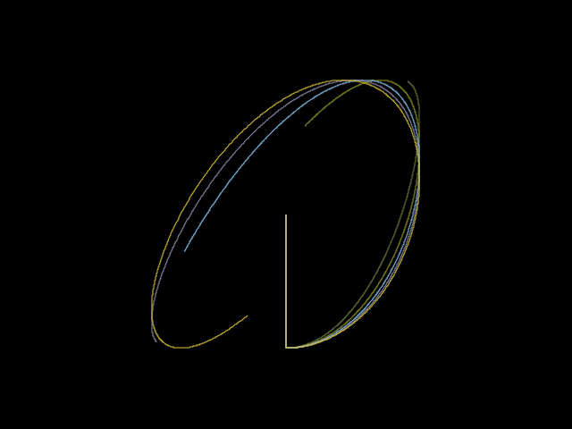

# Project 1 - Parallel Computing

This project involves the creation of a screensaver using C. The implementation includes both sequential and parallel programming approaches to enable performance comparison.

## Example of View


## Authors
- Gustavo Andrés González - 21342
- Maria Marta Ramírez - 21342

## Instructions for Environment Setup

1. **Build the Docker Image**  
    First, build the Docker image using the `Dockerfile` located in the root directory:

    ```bash
    docker build -t proyecto_paralela2 .
    ```

2. ***Run a Container**
    Next, run a container using the image we just built:

    ```bash
    docker run -it --rm --name mi_contenedor \
    -v .:/usr/src/ proyecto_paralela2 /bin/bash
    ```

    *Note*: If you are running this on Windows, we recommend using WSL. Alternatively, replace the . in the bind mount (i.e., -v .:/usr/src/) with the current directory path.

3. **Compile the Program**
    Once inside the container, ensure you are in the working directory /usr/src/. To compile the program, use:
    
    ```bash
    gcc -o test.o test.c `pkg-config --cflags --libs cairo` -lm -fopenmp
    ```

4. **Run the Program**
    Finally, run the executable with the desired number of frames and curves. For example:

    ```bash
    ./test.o 100 '<number of curves>'
    ```

## Recommendations
- Do not set more than 700 frames to avoid long rendering times and potential memory issues within the container.
- The recommended setup is 700 frames and 5 curves to best observe the screensaver's functionality.
- The number of curves is unlimited.